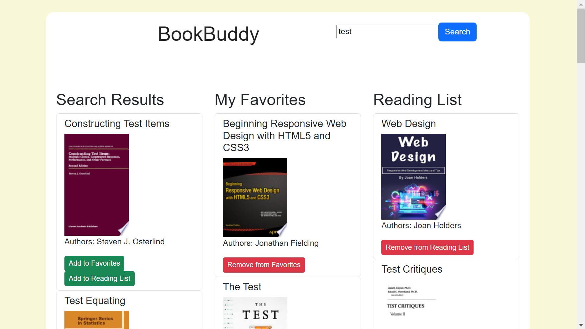

# React + Vite

This template provides a minimal setup to get React working in Vite with HMR and some ESLint rules.

Currently, two official plugins are available:

- [@vitejs/plugin-react](https://github.com/vitejs/vite-plugin-react/blob/main/packages/plugin-react/README.md) uses [Babel](https://babeljs.io/) for Fast Refresh
- [@vitejs/plugin-react-swc](https://github.com/vitejs/vite-plugin-react-swc) uses [SWC](https://swc.rs/) for Fast Refresh


# BookBuddy

## Description

BookBuddy is a simple web application that helps you manage your reading lists. Whether you want to keep track of books you want to read or your favorite ones, BookBuddy is here to assist you. The motivation behind this project was to create a user-friendly and visually appealing way to manage and organize books.

## Table of Contents (Optional)

If your README is long, add a table of contents to make it easy for users to find what they need.

- [Installation](#installation)
- [Usage](#usage)
- [Credits](#credits)
- [License](#license)

## Installation

Link to deployed application: [https://bookbuddyedx.netlify.app/](https://bookbuddyedx.netlify.app/)

## Usage

BookBuddy is straightforward to use:

- Enter a book title in the search bar to find books.
- Browse through the search results.
- Add books to your Favorites or Reading List.
- View and manage your Favorites and Reading List in the respective columns.
- Remove books from the lists if needed.

    ```md
    
    ```

## Credits

Collaborators: https://github.com/GabrielCS22

# React + Vite

This template provides a minimal setup to get React working in Vite with HMR and some ESLint rules.

Currently, two official plugins are available:

- [@vitejs/plugin-react](https://github.com/vitejs/vite-plugin-react/blob/main/packages/plugin-react/README.md) uses [Babel](https://babeljs.io/) for Fast Refresh
- [@vitejs/plugin-react-swc](https://github.com/vitejs/vite-plugin-react-swc) uses [SWC](https://swc.rs/) for Fast Refresh


## License

MIT License